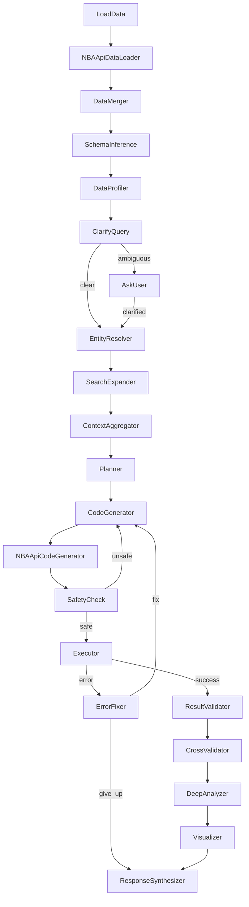

<h1 align="center">NBA Expert - Data Analyst Agent</h1>

## Features

- **Natural Language Queries**: Ask questions about NBA data in plain English
- **Multi-Table Analysis**: Automatically discovers relationships across CSV files and DuckDB tables
- **Entity Resolution**: Finds and matches players, teams, and other entities across tables
- **Deep Analysis**: Statistical comparisons and insights, not just simple lookups
- **Safe Code Execution**: Sandboxed Python execution with safety checks
- **Learning System**: Remembers successful patterns for future queries
- **Honest Reporting**: Clearly reports when data is missing or incomplete
- **DuckDB Integration**: High-performance analytical database for complex queries

## Prerequisites

- **Python 3.11+** (required)
- **uv** - Fast Python package manager ([installation guide](https://docs.astral.sh/uv/getting-started/installation/))
- **OpenRouter API Key** - For LLM access ([get one here](https://openrouter.ai/))

## Installation

### Option 1: Quick Install with uv (Recommended)

```bash
# Clone the repository
git clone https://github.com/nickth3man/nba_expert.git
cd nba_expert

# Install uv if not already installed
curl -LsSf https://astral.sh/uv/install.sh | sh

# Create virtual environment and install all dependencies
uv sync

# Verify installation
uv run python -c "import sys; sys.path.insert(0, 'src'); from frontend import on_chat_start; print('Installation successful!')"
```

### Option 2: Manual venv Setup

```bash
# Clone the repository
git clone https://github.com/nickth3man/nba_expert.git
cd nba_expert

# Create and activate virtual environment using uv
uv venv --python 3.11
source .venv/bin/activate  # Linux/macOS
# or: .venv\Scripts\activate  # Windows

# Install dependencies
uv sync

# Verify installation
python -c "import sys; sys.path.insert(0, 'src'); from frontend import on_chat_start; print('Installation successful!')"
```

### Option 3: Development Installation

```bash
# Clone and install with dev dependencies
git clone https://github.com/nickth3man/nba_expert.git
cd nba_expert

# Install with development dependencies
uv sync

# Install pre-commit hooks
uv run pre-commit install

# Verify with tests
uv run pytest src/tests/unit/ -v --no-cov
```

## Running the Application

### Web Interface (Chainlit)

The web interface provides a chat-based UI for interacting with the agent.

```bash
# Start the web server
uv run chainlit run src/frontend/app.py

# Or specify a port
uv run chainlit run src/frontend/app.py --port 8080

# Or use Make
make run
```

Then open [http://localhost:8000](http://localhost:8000) in your browser.

#### Web Interface Features

- **Chat Interface**: Ask questions and view responses with real-time status updates
- **Quick Actions**: Buttons for common tasks (Upload CSV, List Tables, View Schema, Help)
- **Commands**: Type `/upload`, `/tables`, `/schema`, `/knowledge`, `/help`
- **File Management**: Upload and preview CSV files
- **Knowledge Store**: View learned patterns with `/knowledge`
- **Settings**: Configure API key and model selection

### Command Line Interface (CLI)

The CLI provides direct access to the analyst flow.

```bash
# Run with default question
uv run python src/backend/main.py

# Run with a custom question
uv run python src/backend/main.py "What are the top 10 players by points per game?"

# Or use Make
make run-cli
```

## Configuration

### Environment Variables

| Variable | Description | Default |
|----------|-------------|---------|
| `OPENROUTER_API_KEY` | OpenRouter API key for LLM access | None (required) |
| `NBA_DB_PATH` | Path to DuckDB database | `src/backend/data/nba.duckdb` |
| `NBA_API_DEFAULT_SEASON` | Default NBA season | `2023-24` |
| `NBA_API_TIMEOUT` | API request timeout (seconds) | `30` |
| `NBA_API_DELAY` | Delay between API requests (seconds) | `0.6` |
| `NBA_API_PROXY` | Proxy URL for API requests | None |

### Setting the API Key

**Option 1**: Environment variable
```bash
export OPENROUTER_API_KEY="your-api-key-here"
uv run chainlit run src/frontend/app.py
```

**Option 2**: In the web interface
- Open the Settings panel (gear icon)
- Enter your OpenRouter API key

## Database Population

The project includes a DuckDB database with NBA data. You can populate it with CSV files and/or fetch live data from the NBA API.

### Quick Setup (CSV Only - No API Required)

```bash
# Initialize database and load CSV files
uv run python -m src.scripts.populate.cli all --skip-api
```

### Full Population (Including NBA API Data)

```bash
# Run full pipeline (may take a while due to API rate limits)
uv run python -m src.scripts.populate.cli all

# Or run individual steps:
uv run python -m src.scripts.populate.cli init            # Initialize schema
uv run python -m src.scripts.populate.cli load-csv        # Load CSV files
uv run python -m src.scripts.populate.cli player-games --seasons 2024-25  # Fetch from API
uv run python -m src.scripts.populate.cli normalize       # Normalize data types
uv run python -m src.scripts.populate.cli gold-entities   # Create gold entities
uv run python -m src.scripts.populate.cli gold-tables     # Create canonical tables
uv run python -m src.scripts.populate.cli season-stats    # Create aggregated stats
```

### Population Commands

| Command | Description |
|---------|-------------|
| `init` | Initialize database schema |
| `info` | Show database information and table row counts |
| `load-csv` | Load data from CSV files in `src/backend/data/raw/csv/` |
| `normalize` | Normalize data types and create silver tables |
| `gold-entities` | Create gold entity tables (player_gold, team_gold) |
| `gold-tables` | Create canonical tables (games, team_game_stats, player_game_stats) |
| `player-games` | Fetch player game stats from NBA API (bulk) |
| `player-games-legacy` | Fetch player game stats (per-player, slower) |
| `play-by-play` | Fetch play-by-play data for games |
| `season-stats` | Create aggregated player season statistics |
| `all` | Run full population pipeline |

### Database Contents

After running `load-csv`, the database contains raw landing tables:

| Table | Source | Description |
|-------|--------|-------------|
| `player_raw` | CSV | Player master data (~4,800 players) |
| `team_raw` | CSV | NBA team information (30 teams) |
| `game_raw` | CSV | Historical game records (~65,000 games) |
| `common_player_info_raw` | CSV | Detailed player biographical info |
| `draft_history_raw` | CSV | NBA draft history |

After running `player-games` (raw) and then `normalize` + `gold-tables`:

| Table | Source | Description |
|-------|--------|-------------|
| `player_game_stats_raw` | API | Player box scores per game (raw landing) |
| `player_game_stats` | Canonical | Player box scores per game (typed/canonical) |
| `player_season_stats` | Aggregated | Season averages |

## Example Questions

- "Compare the careers of LeBron James and Tracy McGrady"
- "Which team has the most draft picks?"
- "Show me the top 10 players by games played"
- "What are the statistics for Chicago Bulls?"
- "Find all players drafted in 2003"
- "Who has the highest points per game average?"

## Architecture

The agent uses a 17-node pipeline built with PocketFlow:



## Project Structure

```
nba_expert/
|-- src/
|   |-- backend/
|   |   |-- data/
|   |   |   |-- raw/csv/              # Source CSV files
|   |   |   `-- json/knowledge_store.json
|   |   |-- nodes/                    # PocketFlow node definitions
|   |   |-- utils/                    # Utilities
|   |   |-- flow.py                   # Flow creation and node connections
|   |   |-- main.py                   # CLI entry point
|   |   `-- config.py                 # Configuration constants
|   |-- frontend/                     # Chainlit frontend
|   |   |-- app.py                    # Chainlit web interface entry point
|   |   |-- handlers.py               # Main event handlers
|   |   |-- commands.py               # Slash command handling
|   |   |-- actions.py                # Button action callbacks
|   |   |-- steps.py                  # Analysis pipeline steps
|   |   |-- config.py                 # Frontend configuration
|   |   |-- cache.py                  # DataFrame caching
|   |   |-- data_utils.py             # Data loading utilities
|   |   |-- display.py                # Display utilities
|   |   `-- public/                   # Chainlit static assets
|   |-- scripts/                      # Database population and utilities
|   `-- tests/                        # Test suite
|-- docs/                             # Documentation
|   |-- index.md
|   |-- design.md
|   |-- data_dictionary.md
|   |-- roadmap.md
|   |-- todo_summary.md
|   |-- development/
|   |   |-- setup.md
|   |   `-- tools.md
|   `-- platforms/
|       `-- replit.md
|-- chainlit.md                       # Chainlit welcome screen
|-- .chainlit/config.toml
|-- pyproject.toml
|-- Makefile
`-- README.md
```

## Development

### Running Tests

```bash
# Run all tests
uv run pytest tests/ -v

# Run unit tests only
uv run pytest src/tests/unit/ -v --no-cov

# Run with coverage
uv run pytest tests/ --cov=src --cov-report=html

# Or use Make
make test
make test-cov
```

### Code Quality

```bash
# Linting
uv run ruff check .
uv run ruff check --fix .      # Auto-fix

# Formatting
uv run ruff format .

# Type checking
uv run mypy src/

# Security audit
uv run pip-audit

# Or use Make
make lint
make lint-fix
make type-check
make security
```

### Make Commands

```bash
make help          # Show all available commands
make install       # Install production dependencies
make install-dev   # Install development dependencies
make test          # Run tests
make lint          # Check code quality
make lint-fix      # Auto-fix linting issues
make type-check    # Run type checking
make security      # Run security scans
make run           # Run web application
make run-cli       # Run CLI version
make clean         # Clean build artifacts
make ci            # Run all CI checks
```

## Dependencies

### Core Dependencies

| Package | Purpose |
|---------|---------|
| `pocketflow` | LLM workflow framework |
| `openai` | OpenAI-compatible API client |
| `chainlit` | Web interface |
| `pandas` | Data manipulation |
| `duckdb` | Analytical database |
| `matplotlib` | Visualizations |
| `nba_api` | NBA Stats API client |
| `requests` | HTTP requests |

### Development Dependencies

| Package | Purpose |
|---------|---------|
| `pytest` | Testing framework |
| `ruff` | Linting and formatting |
| `mypy` | Type checking |
| `pre-commit` | Git hooks |
| `pip-audit` | Security scanning |
| `mkdocs` | Documentation |

## Troubleshooting

### Common Issues

**"No module named 'duckdb'"**
```bash
uv sync  # Reinstall dependencies
```

**"OPENROUTER_API_KEY not set"**
```bash
export OPENROUTER_API_KEY="your-key-here"
# Or enter it in the web interface Settings panel
```

**"Rate limit exceeded" from NBA API**
- Wait a few minutes and try again
- Use `--delay` flag to increase delay between requests:
  ```bash
  uv run python -m src.scripts.populate.cli player-games --delay 1.0
  ```

**"Connection refused" on startup**
- Ensure port 8000 is not in use
- Try a different port: `uv run chainlit run src/frontend/app.py --port 9000`

**Tests failing with import errors**
```bash
# Ensure you're in the project root and dependencies are installed
cd nba_expert
uv sync
uv run pytest src/tests/unit/ -v --no-cov
```

## Contributing

1. Fork the repository
2. Create a feature branch: `git checkout -b feature/my-feature`
3. Make your changes
4. Run tests: `uv run pytest tests/`
5. Run linting: `uv run ruff check . && uv run mypy src/`
6. Commit with conventional commits: `uv run cz commit`
7. Push and create a Pull Request

## License

This project is open source. See the repository for license details.

## Acknowledgments

- [PocketFlow](https://github.com/The-Pocket/PocketFlow) - The LLM framework powering this agent
- [Chainlit](https://chainlit.io/) - The web interface framework
- [NBA API](https://github.com/swar/nba_api) - NBA Stats API wrapper
- [DuckDB](https://duckdb.org/) - The analytical database engine
