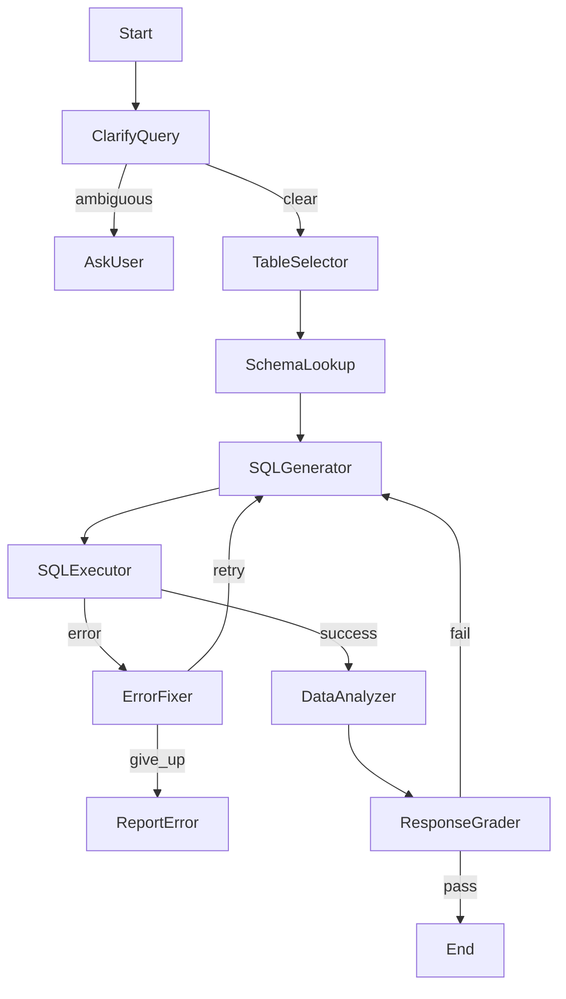

# Design Doc: NBA Data Analyst Agent (DuckDB)

> Please DON'T remove notes for AI

## Requirements

> Notes for AI: Keep it simple and clear.
> The system relies exclusively on a local DuckDB database which serves as the single source of truth.

The NBA Data Analyst Agent is a Text-to-SQL system that allows users to ask natural language questions about NBA data stored in a local DuckDB database. The system assumes the database is fully populated and provides complete read access for analysis.

### Core Capabilities

1.  **DuckDB Integration**: Connects to `data/nba.duckdb` as the exclusive data source.
2.  **Schema Introspection**: Dynamically explores the database structure (tables, columns, types) to understand available data.
3.  **Smart Table Selection**: Identifies the most relevant tables for a user's query from the complete schema to minimize context window usage.
4.  **Text-to-SQL Generation**: Generates valid DuckDB SQL queries to extract the exact data needed.
5.  **Safe Execution**: Executes SQL queries in a read-only mode to prevent data modification.
6.  **Self-Correction**: Automatically detects and fixes SQL syntax errors or execution failures.
7.  **Response Grading**: A dedicated validation step ensures the final answer is accurate, sensible, and directly addresses the user's question before delivery.

### User Stories

- As a user, I want to ask questions like "Who had the highest FG% in 2023?" and get a direct answer derived from the database.
- As a user, I want the system to handle complex queries involving joins (e.g., "Compare team stats for the Lakers vs Celtics").
- As a user, I want assurance that the answer is double-checked for accuracy before I see it.
- As a user, I want the system to explain *how* it derived the answer (e.g., "Based on table X...").

## Flow Design

> Notes for AI:
> 1. Use the "Workflow" pattern with an "Agent" component for the SQL generation and Grading.
> 2. The flow includes a feedback loop from the Grader to ensuring high quality.

### Flow High-Level Design

1.  **ClarifyQuery**: Checks if the user's question is clear enough to be answered.
2.  **TableSelector**: specific node to filter the 50+ available tables down to the relevant few.
3.  **SchemaLookup**: Retrieves detailed schema (DDL) for the selected tables.
4.  **SQLGenerator**: Generates the DuckDB SQL query based on the question and schema.
5.  **SQLExecutor**: Runs the SQL query against the database.
6.  **ErrorFixer**: (Conditional) Fixes SQL errors if execution fails.
7.  **DataAnalyzer**: Synthesizes the SQL results into a natural language response.
8.  **ResponseGrader**: Critiques the final response and SQL. If it fails, it sends feedback back to the generator.



## Utility Functions

> Notes for AI:
> 1. Only include utilities strictly necessary for the Text-to-SQL flow.
> 2. Remove any CSV or API specific utilities.

1.  **DuckDB Client** (`utils/duckdb_client.py`)
    -   *Input*: various (SQL strings, table names)
    -   *Output*: DataFrames, Schema Info
    -   *Necessity*: Core interface to the database.
    -   *Key Methods*:
        -   `get_all_tables()`: Returns list of `{table_name, description}`.
        -   `get_table_schema(table_list)`: Returns CREATE TABLE statements for context.
        -   `execute_query(sql)`: Executes SQL safely (read-only).

2.  **Call LLM** (`utils/call_llm.py`)
    -   *Input*: prompt (str)
    -   *Output*: response (str)
    -   *Necessity*: Powers all reasoning nodes (Selector, Generator, Analyzer, Grader).

## Node Design

### Shared Store

The shared store structure is organized as follows:

```python
shared = {
    # Inputs
    "question": str,              # The user's original question

    # Context & Schema
    "available_tables": list,     # Metadata of all tables in DB
    "selected_tables": list,      # Names of tables relevant to this query
    "table_schemas": str,         # DDL/Schema strings for selected tables

    # Execution State
    "sql_query": str,             # The generated SQL
    "query_result": DataFrame,    # The raw data returned from DuckDB
    "execution_error": str,       # Error message if SQL failed
    "retry_count": int,           # Track retries for ErrorFixer

    # Analysis & Output
    "final_answer": str,          # The drafted natural language response
    "grader_feedback": str,       # Critique from the ResponseGrader
    "grade_status": str           # "pass" or "fail"
}
```

### Node Steps

1.  **ClarifyQuery**
    -   *Type*: Regular
    -   *Exec*: Check if `question` is clear.
    -   *Post*: Return "clear" or "ambiguous".

2.  **TableSelector**
    -   *Type*: Regular
    -   *Prep*: Fetch list of all tables from `DuckDBClient`.
    -   *Exec*: LLM selects top 3-5 tables relevant to `question`.
    -   *Post*: Store `selected_tables`.

3.  **SchemaLookup**
    -   *Type*: Regular
    -   *Prep*: Read `selected_tables`.
    -   *Exec*: Fetch detailed schema (columns, types) using `DuckDBClient`.
    -   *Post*: Store `table_schemas`.

4.  **SQLGenerator**
    -   *Type*: Regular
    -   *Prep*: Read `question`, `table_schemas`, and optional `grader_feedback`/`execution_error`.
    -   *Exec*: LLM generates a DuckDB SQL query. Includes instructions to handle feedback if present.
    -   *Post*: Store `sql_query`.

5.  **SQLExecutor**
    -   *Type*: Regular
    -   *Prep*: Read `sql_query`.
    -   *Exec*: `DuckDBClient.execute_query(sql_query)`. Catch exceptions.
    -   *Post*: If success, store `query_result` -> "success". If error, store `execution_error` -> "error".

6.  **ErrorFixer**
    -   *Type*: Regular
    -   *Prep*: Read `sql_query`, `execution_error`, `retry_count`.
    -   *Exec*: Increment retry. If max retries reached, return "give_up".
    -   *Post*: Return "retry" (goes back to SQLGenerator) or "give_up".

7.  **DataAnalyzer**
    -   *Type*: Regular
    -   *Prep*: Read `question`, `sql_query`, `query_result`.
    -   *Exec*: LLM analyzes the data and writes a natural language answer.
    -   *Post*: Store `final_answer`.

8.  **ResponseGrader**
    -   *Type*: Regular
    -   *Prep*: Read `question`, `sql_query`, `query_result`, `final_answer`.
    -   *Exec*: LLM acts as a critic. Checks:
        1. Does the SQL actually answer the specific question?
        2. Is the data interpretation correct?
        3. Does the final answer make sense?
    -   *Post*:
        -   If accurate: Return "pass".
        -   If issues found: Update `grader_feedback` and return "fail" (loops back to SQLGenerator).
