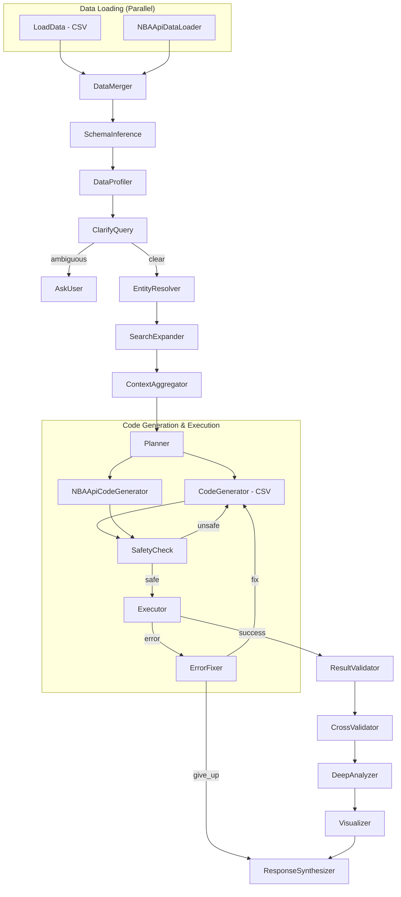

# Design Doc: Relational Data Analyst Agent

> Please DON'T remove notes for AI

## Requirements

> Notes for AI: Keep it simple and clear.
> If the requirements are abstract, write concrete user stories

The Relational Data Analyst Agent is an LLM-powered system that allows users to ask natural language questions about NBA data. The agent uses a **dual data source architecture** that queries both local CSV files and the live NBA API in parallel, then synthesizes and cross-validates results for maximum accuracy.

### Core Capabilities

1. **Loads CSV files** from a designated folder (`CSV/`)
2. **Queries NBA API** in parallel for **all data types** (historical, static, live, advanced) via `nba_api` package
3. **Infers schemas** from the loaded dataframes (both CSV and API sources)
4. **Profiles data** to analyze table statistics, data quality, and identify key columns
5. **Resolves entities** mentioned in queries across all data sources
6. **Expands search** to discover entity cross-references and IDs across tables
7. **Aggregates context** to collect insights and pass enriched context between nodes
8. **Plans and generates code** to answer user questions using both data sources
9. **Executes code safely** in a sandboxed environment
10. **Validates results** to verify execution matches the original question
11. **Cross-validates results** between CSV and API sources for accuracy
12. **Performs deep analysis** with statistical comparisons
13. **Synthesizes narrative responses** from combined analysis results
14. **Learns from queries** via persistent KnowledgeStore
15. **Handles errors gracefully** with automatic retry and error correction

16. **Advanced Metrics & Play Style Analysis**: Deriving play styles from usage, efficiency, and shooting splits
17. **Lineup Optimization**: Algorithms to construct teams based on user-defined constraints and maximization metrics

### User Stories

- As a user, I want to ask questions about NBA data in plain English
- As a user, I want to compare players across eras, analyzing play styles, advanced stats, and career totals
- As a user, I want to generate optimal lineups based on specific constraints (e.g., "Lakers all-time best", "all-center lineup")
- As a user, I want to compare entities (e.g., "Compare LeBron James and Tracy McGrady careers")
- As a user, I want the system to automatically understand my CSV file structures
- As a user, I want access to real-time NBA data alongside my CSV files
- As a user, I want the system to cross-validate data between sources for accuracy
- As a user, I want to see discrepancies between data sources highlighted
- As a user, I want deep statistical analysis, not just simple lookups
- As a user, I want narrative responses that tell a story about the data
- As a user, I want safe code execution that prevents malicious operations
- As a user, I want the system to learn and improve from previous queries
- As a user, I want honest reporting when data is incomplete or missing

---

## NBA API Integration

> Notes for AI: The nba_api package is a Python client for NBA.com APIs. It provides both static data (no HTTP) and live endpoints (HTTP requests). Rate limiting is critical - NBA.com has aggressive rate limits.

### nba_api Package Overview

The `nba_api` package (https://github.com/swar/nba_api) provides:

#### Static Data (No HTTP Requests)
```python
from nba_api.stats.static import players, teams

# Players - 5000+ players in database
players.get_players()                    # All NBA players
players.get_active_players()             # Currently active players (537+)
players.find_players_by_full_name(name)  # Search by name (regex)
players.find_player_by_id(player_id)     # Lookup by ID

# Teams - All 30 NBA teams
teams.get_teams()                        # All NBA teams
teams.find_team_by_abbreviation(abbr)    # e.g., 'LAL' -> Lakers
teams.find_teams_by_city(city)           # e.g., 'Los Angeles'
```

#### Stats Endpoints (HTTP Requests to NBA.com)

| Category | Key Endpoints | Data Available |
|----------|--------------|----------------|
| **Player Stats** | `PlayerCareerStats`, `PlayerGameLog`, `CommonPlayerInfo` | Career totals, season averages, per-game logs, biographical info |
| **Team Stats** | `TeamGameLog`, `TeamYearByYearStats`, `TeamInfoCommon` | Team performance by season, historical records |
| **Game Data** | `BoxScoreTraditionalV2`, `PlayByPlayV2`, `GameRotation` | Box scores, play-by-play, player rotations |
| **League Data** | `LeagueLeaders`, `LeagueStandings`, `DraftHistory`, `CommonTeamRoster` | League leaders, standings, draft picks, rosters |
| **Advanced** | `LeagueDashPlayerStats`, `PlayerDashboardByShootingSplits`, `SynergyPlayType` | Advanced metrics (USG%, PER), shot charts, play types |

#### Live Data Endpoints (Real-time)
```python
from nba_api.live.nba.endpoints import scoreboard, boxscore

scoreboard.ScoreBoard()        # Today's games and live scores
boxscore.BoxScore(game_id)     # Live box score for specific game
```

### Key Data Structures from nba_api

**Player Career Stats Columns:**
```
PLAYER_ID, SEASON_ID, LEAGUE_ID, TEAM_ID, TEAM_ABBREVIATION, PLAYER_AGE,
GP, GS, MIN, FGM, FGA, FG_PCT, FG3M, FG3A, FG3_PCT, FTM, FTA, FT_PCT,
OREB, DREB, REB, AST, STL, BLK, TOV, PF, PTS
```

**Common Player Info Columns:**
```
PERSON_ID, FIRST_NAME, LAST_NAME, DISPLAY_FIRST_LAST, BIRTHDATE, SCHOOL,
COUNTRY, HEIGHT, WEIGHT, SEASON_EXP, JERSEY, POSITION, TEAM_ID, TEAM_NAME,
DRAFT_YEAR, DRAFT_ROUND, DRAFT_NUMBER, GREATEST_75_FLAG
```

**League Leaders Columns:**
```
PLAYER_ID, RANK, PLAYER, TEAM_ID, TEAM, GP, MIN, FGM, FGA, FG_PCT,
FG3M, FG3A, FG3_PCT, FTM, FTA, FT_PCT, OREB, DREB, REB, AST, STL, BLK,
TOV, PF, PTS, EFF, AST_TOV, STL_TOV
```

### Rate Limiting Requirements

- **Minimum delay**: 0.6 seconds between API requests
- **Recommended**: 1.0 second delay for reliability
- **Caching**: Cache API responses for 1 hour to reduce requests
- **Fallback**: If API fails, gracefully degrade to CSV-only mode

---

## Flow Design

> Notes for AI:
> 1. Consider the design patterns of agent, map-reduce, rag, and workflow. Apply them if they fit.
> 2. Present a concise, high-level description of the workflow.
> 3. The parallel data source pattern requires careful coordination between CSV and API pipelines.

### Applicable Design Patterns

1. **Workflow Pattern**: A sequential pipeline of nodes with conditional branching for error handling
2. **Parallel Execution Pattern**: CSV and NBA API data are fetched/processed in parallel
3. **Agent Pattern**: LLM-driven planning and code generation based on context (schema + question)
4. **Error Correction Loop**: Automatic retry mechanism with max attempts
5. **Memory Pattern**: KnowledgeStore for persistent learning across queries
6. **Context Enrichment Pattern**: Multiple nodes progressively enrich context for better analysis
7. **Cross-Validation Pattern**: Results from both data sources are compared and reconciled

### Flow High-Level Design (21 Nodes)

#### Data Loading Layer (Parallel)
1. **LoadData**: Scans CSV folder and loads all CSV files as pandas DataFrames
2. **NBAApiDataLoader**: Fetches relevant data from NBA API based on detected entities
3. **DataMerger**: Combines CSV and API data, resolving conflicts and marking data sources

#### Schema & Profiling Layer
4. **SchemaInference**: Extracts column names from all DataFrames to build unified schema
5. **DataProfiler**: Analyzes table statistics, data quality, and identifies key columns

#### Query Understanding Layer
6. **ClarifyQuery**: Validates the user's question against available schema
7. **EntityResolver**: Discovers which tables contain data about entities mentioned in query
8. **SearchExpander**: Finds entity cross-references and IDs across tables

#### Planning Layer
9. **ContextAggregator**: Collects insights and passes enriched context with recommended tables
10. **Planner**: Uses LLM to create analysis plan, informed by entity resolution

#### Execution Layer (Parallel Pipelines)
11. **CodeGenerator**: Generates Python/pandas code for CSV data analysis
12. **NBAApiCodeGenerator**: Generates code for NBA API data analysis
13. **SafetyCheck**: AST-based security check for both code snippets
14. **Executor**: Runs generated code in sandboxed environment
15. **ErrorFixer**: Handles execution errors with retry logic

#### Validation & Synthesis Layer
16. **ResultValidator**: Verifies execution results match the original question
17. **CrossValidator**: Compares results from CSV and API sources, flags discrepancies
18. **DeepAnalyzer**: Performs comprehensive statistical analysis on combined results
19. **Visualizer**: Creates visualizations for DataFrame results
20. **ResponseSynthesizer**: Generates narrative response with source attribution
21. **AskUser**: Terminal node for ambiguous queries



---

## Utility Functions

> Notes for AI:
> 1. Understand the utility function definition thoroughly by reviewing the doc.
> 2. Include only the necessary utility functions, based on nodes in the flow.

### 1. Call LLM (`utils/call_llm.py`)
- *Input*: prompt (str)
- *Output*: response (str)
- *Config*: Uses OpenRouter API with configurable model via environment variables
- *Environment Variables*:
  - `OPENROUTER_API_KEY`: API key for OpenRouter
  - `OPENROUTER_MODEL`: Model to use (default: meta-llama/llama-3.3-70b-instruct)
- Used by: Planner, CodeGenerator, EntityResolver, DeepAnalyzer, ResponseSynthesizer nodes

### 2. KnowledgeStore (`utils/knowledge_store.py`)
- *Purpose*: Persistent memory for learned patterns and entity mappings
- *Storage*: JSON file (`knowledge_store.json`)
- *Methods*:
  - `load()`: Load knowledge from disk
  - `save()`: Persist knowledge to disk
  - `get_entity_hints(entity_name)`: Get known table/column mappings for an entity
  - `add_entity_mapping(entity, table, columns)`: Store new entity discovery
  - `get_successful_patterns(query_type)`: Get past successful query patterns
  - `add_successful_pattern(query_type, pattern)`: Store successful pattern
- *Important*: Knowledge is used as hints/guides, never as absolute facts

### 3. NBA API Client (`utils/nba_api_client.py`) - NEW
- *Purpose*: Unified interface to nba_api with caching, rate limiting, and error handling
- *Dependencies*: `nba_api` package
- *Config*:
  - `REQUEST_DELAY`: 0.6 seconds minimum between requests
  - `CACHE_TTL`: 3600 seconds (1 hour) for cached responses
  - `CACHE_DIR`: `.nba_cache/` directory for persistent cache
- *Methods*:

#### Static Data (No HTTP)
```python
get_all_players() -> List[Dict]           # All 5000+ NBA players
get_active_players() -> List[Dict]        # Currently active players
find_player(name: str) -> Optional[Dict]  # Find player by name
get_player_id(name: str) -> Optional[int] # Get player ID from name
get_all_teams() -> List[Dict]             # All 30 NBA teams
find_team(name: str) -> Optional[Dict]    # Find team by name/city/abbr
```

#### Player Stats (HTTP with caching)
```python
get_player_career_stats(player_id: int) -> Dict[str, pd.DataFrame]
  # Returns: regular_season, post_season, career_regular, career_post

get_player_info(player_id: int) -> pd.DataFrame
  # Returns: biographical info, draft info, physical stats

get_player_game_log(player_id: int, season: str) -> pd.DataFrame
  # Returns: game-by-game stats for a season
```

#### Team Stats (HTTP with caching)
```python
get_team_game_log(team_id: int, season: str) -> pd.DataFrame
get_team_year_by_year_stats(team_id: int) -> pd.DataFrame
```

#### League Data (HTTP with caching)
```python
get_league_leaders(season: str, stat_category: str) -> pd.DataFrame
  # stat_category: PTS, REB, AST, STL, BLK, FG_PCT, etc.

get_standings(season: str) -> pd.DataFrame
get_draft_history() -> pd.DataFrame
```

#### Live Data (HTTP, no caching)
```python
get_today_scoreboard() -> Dict
get_live_games() -> List[Dict]
```

### 4. Data Source Manager (`utils/data_source_manager.py`) - NEW
- *Purpose*: Coordinate between CSV and NBA API data sources
- *Methods*:
  - `detect_query_entities(question: str) -> List[str]`: Extract entity names from question
  - `determine_api_endpoints(entities: List[str]) -> List[Dict]`: Map entities to API endpoints
  - `merge_data_sources(csv_data: Dict, api_data: Dict) -> Dict`: Combine with source tracking
  - `reconcile_conflicts(csv_value, api_value, field: str) -> Tuple[Any, str]`: Resolve discrepancies
- *Conflict Resolution Rules*:
  - For current season stats: Prefer API (more recent)
  - For historical stats: Always fetch from API to cross-validate against CSV. Flag if >5% difference.
  - For biographical data: Prefer API (authoritative source)
  - For derived/calculated fields: Use CSV if matches expectations

---

## Node Design

### Shared Store

> Notes for AI: Try to minimize data redundancy. Track data source for each dataframe.

The shared store structure is organized as follows:

```python
shared = {
    # Input
    "question": str,              # User's natural language question
    
    # Data loaded from CSV files
    "csv_dfs": dict,              # {"table_name": pd.DataFrame, ...} from CSV
    "csv_schema_str": str,        # Schema description for CSV data
    
    # Data loaded from NBA API
    "api_dfs": dict,              # {"table_name": pd.DataFrame, ...} from API
    "api_schema_str": str,        # Schema description for API data
    "api_endpoints_used": list,   # List of API endpoints called
    "api_errors": list,           # Any API errors encountered
    
    # Merged data
    "dfs": dict,                  # Combined dataframes with source tracking
    "schema_str": str,            # Unified schema description
    "data_sources": dict,         # {table_name: "csv"|"api"|"merged"}
    
    # Data Profiling
    "data_profile": dict,         # Table statistics, data quality info, key columns
    
    # Entity Resolution
    "entities": list,             # Entities extracted from question
    "entity_map": dict,           # {entity: {table: [columns], ...}, ...}
    "entity_ids": dict,           # {entity_name: nba_player_id, ...} from API
    "knowledge_hints": dict,      # Hints from KnowledgeStore
    
    # Search Expansion
    "cross_references": dict,     # {entity: {table.column: id_value, ...}, ...}
    
    # Context Aggregation
    "aggregated_context": dict,   # Combined insights, recommended tables, join keys
    "context_summary": str,       # Human-readable summary for code generation
    
    # Planning and code
    "plan_steps": str,            # LLM-generated analysis plan
    "csv_code_snippet": str,      # Generated Python code for CSV analysis
    "api_code_snippet": str,      # Generated Python code for API analysis
    
    # Execution state
    "csv_exec_result": Any,       # Result from CSV code execution
    "api_exec_result": Any,       # Result from API code execution
    "exec_result": Any,           # Combined/final execution result
    "exec_error": str,            # Error message if execution failed
    "retry_count": int,           # Number of retry attempts (max 3)
    
    # Validation
    "validation_result": dict,    # Verification that results match question
    "cross_validation": dict,     # Comparison between CSV and API results
    "discrepancies": list,        # List of data discrepancies found
    
    # Deep Analysis
    "deep_analysis": dict,        # Comprehensive analysis results
    
    # Output
    "chart_path": str,            # Path to generated visualization (if any)
    "final_text": str,            # Final formatted response to user
    "source_attribution": dict,   # Which data came from which source
}
```

### Node Steps

> Notes for AI: Carefully decide whether to use Batch/Async Node/Flow. The parallel data loading should use threading or async for performance.

#### Data Loading Layer

**1. LoadData**
- *Purpose*: Load all CSV files from the CSV directory
- *Type*: Regular Node
- *Steps*:
  - *prep*: Return path to CSV directory
  - *exec*: Scan directory and read each .csv file into a DataFrame
  - *post*: Store dict of DataFrames in `shared["csv_dfs"]`

**2. NBAApiDataLoader** - NEW
- *Purpose*: Fetch relevant data from NBA API based on question context (Historical, Live, and Static)
- *Type*: Regular Node (with internal rate limiting)
- *Note*: API is NOT just for live data. It must be queried for historical player stats, team history, and roster data to validate CSVs.
- *Steps*:
  - *prep*: Read question, extract potential entity names using simple pattern matching
  - *exec*: 
    1. Use static data to resolve player/team IDs (no HTTP)
    2. Determine which API endpoints are relevant based on question type
    3. Fetch data from API with rate limiting and caching
    4. Handle API errors gracefully (timeout, rate limit, not found)
  - *post*: Store API dataframes in `shared["api_dfs"]`, errors in `shared["api_errors"]`
- *Question Type Detection*:
  - Player comparison → `PlayerCareerStats`, `LeagueDashPlayerStats` (Advanced)
  - Current season stats → `LeagueLeaders`, `PlayerGameLog`
  - Team stats → `TeamYearByYearStats`, `TeamGameLog`
  - Draft questions → `DraftHistory`
  - Live scores → `scoreboard.ScoreBoard()`
  - Lineup/Roster optimization → `CommonTeamRoster` (for specific teams), `LeagueLeaders` (All Time)
- *Error Handling*:
  - On timeout: Retry once, then skip endpoint
  - On rate limit: Wait and retry
  - On not found: Log warning, continue without data
- *Output*: `{endpoint_name: pd.DataFrame, ...}`

**3. DataMerger** - NEW
- *Purpose*: Combine CSV and API data with source tracking and conflict resolution
- *Type*: Regular Node
- *Steps*:
  - *prep*: Read `csv_dfs` and `api_dfs` from shared store
  - *exec*:
    1. Create unified table registry with source tracking
    2. For overlapping data (same entity, same stats):
       - Compare values, flag discrepancies >5%
       - Apply conflict resolution rules (prefer API for current, validate historical)
    3. Create merged dataframes with `_source` column
  - *post*: Store merged data in `shared["dfs"]`, discrepancies in `shared["discrepancies"]`
- *Merge Strategy*:
  ```python
  # Example merge for player stats
  merged_df = csv_df.merge(api_df, on='PLAYER_ID', suffixes=('_csv', '_api'))
  merged_df['PTS_diff_pct'] = abs(merged_df['PTS_csv'] - merged_df['PTS_api']) / merged_df['PTS_api']
  merged_df['PTS'] = merged_df['PTS_api']  # Prefer API
  merged_df['_source'] = 'api'
  ```

#### Schema & Profiling Layer

**4. SchemaInference**
- *Purpose*: Extract column information from all DataFrames (CSV + API)
- *Type*: Regular Node
- *Steps*:
  - *prep*: Read `dfs` from shared store
  - *exec*: Build unified schema string with table names, column lists, and source indicators
  - *post*: Store schema in `shared["schema_str"]`
- *Output Format*:
  ```
  Table 'player_career_stats' [API]: [PLAYER_ID, SEASON_ID, GP, PTS, REB, AST, ...]
  Table 'common_player_info' [CSV]: [PERSON_ID, FIRST_NAME, LAST_NAME, ...]
  Table 'live_standings' [API]: [TEAM_ID, WINS, LOSSES, WIN_PCT, ...]
  ```

**5. DataProfiler**
- *Purpose*: Analyze table statistics, data quality, and identify key columns
- *Type*: Regular Node
- *Steps*:
  - *prep*: Read `dfs` from shared store
  - *exec*: For each table, identify name columns, ID columns, numeric columns, row counts
  - *post*: Store profile in `shared["data_profile"]`
- *Output*: `{table: {name_cols, id_cols, numeric_cols, row_count, data_quality, source}}`

#### Query Understanding Layer

**6. ClarifyQuery**
- *Purpose*: Validate if user question can be answered with available data
- *Type*: Regular Node
- *Steps*:
  - *prep*: Read question and schema from shared
  - *exec*: Check for ambiguous references
  - *post*: Return "clear" or "ambiguous" action

**7. AskUser**
- *Purpose*: Handle ambiguous queries with interactive clarification (CLI) or termination (Web UI)
- *Type*: Regular Node (conditional terminal)
- *Steps*:
  - *prep*: Read final_text, question, schema_str, and is_cli flag
  - *exec*: In CLI mode, prompt user for clarification. Return action and clarified question.
  - *post*: If clarified, update shared["question"] and return "clarified". Otherwise terminate.
- *Actions*: "clarified" (re-enter flow), "quit" (user exit), "default" (web UI termination)

**8. EntityResolver**
- *Purpose*: Discover all tables/columns containing data about entities in the query
- *Type*: Regular Node
- *Steps*:
  - *prep*: Read question, schema, dfs, and load KnowledgeStore hints
  - *exec*: 
    1. Use LLM to extract entities from question
    2. Use nba_api static data to get official player/team IDs
    3. Search all tables for matches
  - *post*: Store entity_map, entity_ids, and knowledge_hints in shared store
- *Output*: 
  - `entity_map`: Map of entity → {table → [matching_columns]}
  - `entity_ids`: Map of entity name → official NBA ID (for API queries)

**9. SearchExpander**
- *Purpose*: Find entity cross-references and IDs across tables
- *Type*: Regular Node
- *Steps*:
  - *prep*: Read entity_map, entity_ids, data_profile, dfs
  - *exec*: For each entity, search ID columns to find cross-references
  - *post*: Store cross-references in `shared["cross_references"]`
- *Output*: `{entity: {table.column: id_value, ...}}`
- *Example*: `{"LeBron James": {"player_id": 2544, "common_player_info.PERSON_ID": "2544", "career_stats.PLAYER_ID": "2544"}}`

#### Planning Layer

**10. ContextAggregator**
- *Purpose*: Collect insights and pass enriched context between nodes
- *Type*: Regular Node
- *Steps*:
  - *prep*: Read entity_map, entity_ids, cross_references, data_profile, question, data_sources
  - *exec*: Combine all context including:
    - Entity locations in both CSV and API data
    - Official NBA IDs for entities
    - Recommended tables with source preference
    - Join keys between CSV and API tables
    - Data quality notes and known discrepancies
  - *post*: Store aggregated context in `shared["aggregated_context"]`
- *Output*: Unified context object with recommendations for Planner/CodeGenerator

**11. Planner**
- *Purpose*: Generate analysis plan using LLM, informed by dual data sources
- *Type*: Regular Node
- *Steps*:
  - *prep*: Read question, schema, entity_map, aggregated_context, knowledge_hints
  - *exec*: Call LLM with enhanced planning prompt that includes:
    - Available data from both CSV and API sources
    - Entity IDs for API queries
    - Recommendation to query both sources for cross-validation
  - *post*: Store plan in `shared["plan_steps"]`
- *Plan Structure*:
  ```
  1. CSV Analysis: Query local tables for [entities]
  2. API Analysis: Fetch current stats via [endpoints] for [entity_ids]
  3. Cross-Validation: Compare results, flag discrepancies
  4. Synthesis: Combine findings, prefer [source] for [reason]
  
  Lineup Optimization Plan:
  1. Candidate Selection: Fetch pool of players matching constraints (e.g., "All Centers", "Lakers History")
  2. Metric Calculation: Calculate ranking metric (PER, Win Shares, or user criteria)
  3. Filtering: Apply "non-repeating", "positional" constraints
  4. Selection: Select top N players to form lineup
  ```

#### Execution Layer

**12. CodeGenerator**
- *Purpose*: Generate Python/pandas code for CSV data analysis
- *Type*: Regular Node
- *Steps*:
  - *prep*: Read plan, schema, question, entity_map, aggregated_context, previous errors
  - *exec*: Call LLM to generate code with awareness of entity locations
  - *post*: Store code in `shared["csv_code_snippet"]`
- *Design*: Uses DYNAMIC_GUIDANCE with safe patterns but NO hardcoded table names
- *Important*: Generated code should store results in `csv_result` variable

**13. NBAApiCodeGenerator** - NEW
- *Purpose*: Generate Python code for NBA API data analysis
- *Type*: Regular Node
- *Steps*:
  - *prep*: Read plan, api_schema, question, entity_ids, aggregated_context
  - *exec*: Call LLM to generate code that:
    1. Uses nba_api_client utility functions
    2. Handles rate limiting (already built into client)
    3. Processes API responses into comparable format
  - *post*: Store code in `shared["api_code_snippet"]`
- *Code Template*:
  ```python
  from utils.nba_api_client import nba_client
  
  api_result = {}
  # Get player career stats
  career = nba_client.get_player_career_stats(player_id=2544)
  api_result['career_totals'] = career['career_regular']
  
  # Get current season stats
  game_log = nba_client.get_player_game_log(player_id=2544, season='2024-25')
  api_result['current_season'] = game_log
  ```

**14. SafetyCheck**
- *Purpose*: AST-based security validation for both code snippets
- *Type*: Regular Node
- *Steps*:
  - *prep*: Read both csv_code_snippet and api_code_snippet
  - *exec*: Parse AST and check for forbidden imports/operations
  - *post*: Return "safe" or "unsafe" action
- *Allowed for API code*: `nba_api_client` utility, `pandas`, `time.sleep`
- *Forbidden*: os, subprocess, sys, shutil, socket, requests (direct), eval, exec

**15. Executor**
- *Purpose*: Execute generated code in sandboxed environment with timeout protection
- *Type*: Regular Node
- *Config*: 
  - `CSV_EXECUTION_TIMEOUT`: 30 seconds
  - `API_EXECUTION_TIMEOUT`: 60 seconds (longer due to HTTP requests)
- *Steps*:
  - *prep*: Read both code snippets and dataframes
  - *exec*: Execute code in separate threads with timeout
    1. Execute CSV code with `dfs` in scope → `csv_result`
    2. Execute API code with `nba_client` in scope → `api_result`
  - *post*: Store results, return "success" or "error"
- *Scope*:
  - CSV execution: `dfs`, `pd`
  - API execution: `nba_client`, `pd`, `time`

**16. ErrorFixer**
- *Purpose*: Handle execution errors with retry limit
- *Type*: Regular Node
- *Config*: MAX_RETRIES = 3
- *Steps*:
  - *prep*: Read error, code, and retry count
  - *exec*: Check if max retries exceeded, determine which code failed
  - *post*: Increment retry count, return "fix" or "give_up" action
- *Error Context*: Includes which source (CSV/API) failed

#### Validation & Synthesis Layer

**17. ResultValidator**
- *Purpose*: Verify execution results match the original question and entity map
- *Type*: Regular Node
- *Steps*:
  - *prep*: Read csv_exec_result, api_exec_result, question, entity_map
  - *exec*: Check that all queried entities appear in results from at least one source
  - *post*: Store validation_result, provide data gap warnings
- *Output*: `{entities_found: [], entities_missing: [], sources_with_data: {}}`

**18. CrossValidator** - NEW
- *Purpose*: Compare results from CSV and API sources, identify and reconcile discrepancies
- *Type*: Regular Node
- *Steps*:
  - *prep*: Read csv_exec_result, api_exec_result, entity_ids
  - *exec*:
    1. Align results by entity (using entity_ids for matching)
    2. Compare numeric fields (e.g., career points, games played)
    3. Calculate discrepancy percentages
    4. Categorize discrepancies:
       - Minor (<2%): Likely rounding differences
       - Moderate (2-5%): Possible data staleness
       - Major (>5%): Flag for user attention
    5. Apply reconciliation rules to create final result
  - *post*: Store cross_validation results, discrepancies, and reconciled exec_result
- *Output*:
  ```python
  {
    "agreement_score": 0.95,  # 95% of comparable fields match
    "discrepancies": [
      {"field": "career_points", "csv": 38352, "api": 38390, "diff_pct": 0.1, "severity": "minor"},
    ],
    "reconciled_values": {...},
    "source_preference": {"career_stats": "api", "draft_info": "csv"}
  }
  ```
- *Reconciliation Rules*:
  - Current season stats: Always prefer API (most up-to-date)
  - Career totals: Prefer API if within current season, otherwise average if close
  - Biographical data: Prefer API (authoritative source)
  - Historical records: Flag major discrepancies, use CSV if API unavailable

**19. DeepAnalyzer**
- *Purpose*: Perform comprehensive statistical analysis on combined results
- *Type*: Regular Node
- *Steps*:
  - *prep*: Read exec_result, cross_validation, question, entity_map
  - *exec*: Use LLM to perform deeper analysis including:
    - Source-attributed statistics
    - Confidence levels based on cross-validation
    - Trend analysis combining historical (CSV) and current (API) data
  - *post*: Store deep_analysis in shared store
- *Analysis Types*:
  - Career comparisons with confidence scores
  - Statistical rankings with recency weighting
  - Trend analysis over time
  - Cross-source agreement analysis

**20. Visualizer**
- *Purpose*: Create charts for DataFrame results with source attribution
- *Type*: Regular Node
- *Steps*:
  - *prep*: Read execution result, source_attribution
  - *exec*: Generate plot if result is a DataFrame, include source legend
  - *post*: Store chart path in `shared["chart_path"]`

**21. ResponseSynthesizer**
- *Purpose*: Generate narrative response with source attribution and confidence levels
- *Type*: Regular Node
- *Steps*:
  - *prep*: Read exec_result, deep_analysis, cross_validation, question, entity_map
  - *exec*: Use LLM to synthesize response that includes:
    - Main findings with source attribution
    - Confidence levels based on cross-validation
    - Notable discrepancies (if any)
    - Data freshness indicators
  - *post*: Store in `shared["final_text"]`, update KnowledgeStore
- *Output Format*:
  ```markdown
  ## Career Comparison: LeBron James vs Tracy McGrady
  
  ### LeBron James
  - Career Points: 38,390 (Source: NBA.com API, as of Dec 2024)
  - Games Played: 1,492 (Cross-validated: CSV ✓, API ✓)
  
  ### Tracy McGrady
  - Career Points: 18,381 (Source: CSV historical data)
  - Games Played: 938 (Cross-validated: CSV ✓)
  
  ### Data Notes
  - LeBron's stats updated from live API (last game: Dec 23, 2024)
  - Tracy McGrady data from historical records (retired 2013)
  - Cross-validation agreement: 98.5%
  ```

---

## File Structure

```
project/
├── main.py                    # CLI entry point - runs the flow
├── app.py                     # Web UI entry point (Chainlit)
├── nodes.py                   # All node class definitions (21 nodes)
├── flow.py                    # Flow creation and node wiring
├── frontend/                  # Modular frontend components
│   ├── __init__.py            # Module initialization
│   ├── config.py              # Configuration and constants
│   ├── cache.py               # Dataframe caching
│   ├── data_utils.py          # Data loading and schema utilities
│   ├── knowledge_utils.py     # Knowledge store utilities
│   ├── commands.py            # Command handling
│   ├── actions.py             # Action callbacks
│   ├── steps.py               # Analysis pipeline steps
│   └── handlers.py            # Main event handlers
├── utils/
│   ├── __init__.py
│   ├── call_llm.py            # OpenRouter LLM wrapper
│   ├── knowledge_store.py     # Persistent memory system
│   ├── nba_api_client.py      # NBA API wrapper with caching (NEW)
│   └── data_source_manager.py # Data source coordination (NEW)
├── knowledge_store.json       # Persisted learnings (auto-created)
├── .nba_cache/                # NBA API response cache (auto-created)
├── CSV/                       # User's CSV data files go here
├── docs/
│   └── design.md              # This design document
├── .env.example               # Environment variable template
└── requirements.txt           # Python dependencies
```

---

## Configuration

### Environment Variables

| Variable | Description | Default |
|----------|-------------|---------|
| `OPENROUTER_API_KEY` | OpenRouter API key | (required) |
| `OPENROUTER_MODEL` | Model to use | `meta-llama/llama-3.3-70b-instruct` |
| `NBA_API_CACHE_TTL` | Cache TTL in seconds | `3600` |
| `NBA_API_REQUEST_DELAY` | Delay between API requests | `0.6` |
| `NBA_API_ENABLED` | Enable/disable NBA API | `true` |

### Dependencies

```
pocketflow          # Core flow framework
openai              # OpenAI-compatible client for OpenRouter
pandas              # Data manipulation
matplotlib          # Chart generation for visual summaries
requests            # Model list fetching in Chainlit UI
chainlit            # Web chat interface
nba_api             # NBA.com API client (NEW)
```

---

## Usage

### Basic Usage

1. Place CSV files in the `CSV/` directory
2. Edit the question in `main.py`
3. Run: `python main.py`

### Web Interface (Chainlit)

1. Run: `chainlit run app.py`
2. Upload CSVs in the UI and ask questions in chat

### Example Queries

**Cross-validated queries (uses both sources):**
- "Compare the careers of LeBron James and Tracy McGrady"
- "Who are the top 10 scorers in the current season?"
- "Show me the Lakers' record this year vs last year"

**CSV-focused queries:**
- "Show me the draft history of players from Duke University"
- "What's the historical average points per game for the Bulls?"

**API-focused queries:**
- "What's today's NBA scoreboard?"
- "Get LeBron's stats from his last 10 games"
- "Who is leading the league in assists right now?"

---

## Key Design Principles

1. **Dual Data Source Architecture**: Every query leverages both CSV and NBA API data when possible
2. **Cross-Validation for Accuracy**: Results are compared between sources to ensure accuracy
3. **Source Attribution**: All data clearly indicates its source (CSV vs API)
4. **Graceful Degradation**: If API fails, system continues with CSV-only mode
5. **Rate Limit Respect**: Built-in delays and caching to avoid API throttling
6. **Dynamic Table Discovery**: No hardcoded table names - system adapts to any data structure
7. **Entity Cross-Referencing**: Automatically discovers entity IDs for accurate API queries
8. **Context Enrichment**: Multiple nodes progressively build richer context for better analysis
9. **Data Integrity**: Honestly reports discrepancies and data limitations
10. **Self-Healing**: Automatic error detection and code fixing with retry logic
11. **Caching Strategy**: API responses cached for 1 hour to balance freshness and performance

---

## Cross-Validation Logic

### Agreement Scoring

```python
def calculate_agreement_score(csv_value, api_value, field_type):
    """Calculate how well CSV and API values agree."""
    if field_type == 'count':  # GP, GS, etc.
        diff = abs(csv_value - api_value)
        if diff == 0: return 1.0
        if diff <= 2: return 0.95
        if diff <= 5: return 0.8
        return 0.5
    
    elif field_type == 'stat':  # PTS, REB, AST, etc.
        if api_value == 0: return 1.0 if csv_value == 0 else 0.0
        diff_pct = abs(csv_value - api_value) / api_value
        if diff_pct < 0.01: return 1.0   # <1% difference
        if diff_pct < 0.02: return 0.95  # <2% difference
        if diff_pct < 0.05: return 0.8   # <5% difference
        return 0.5  # >5% difference - flag for attention
```

### Reconciliation Priority

1. **Live/Current Data**: API always wins (most up-to-date)
2. **Career Totals**: API preferred for active players, CSV for retired
3. **Historical Seasons**: Cross-validate, average if within 2%, flag otherwise
4. **Biographical Info**: API preferred (authoritative source)
5. **Derived Stats**: Recalculate from reconciled base stats

---

## Error Handling

### API Failure Modes

| Error Type | Handling Strategy |
|------------|-------------------|
| Rate Limited | Wait 2 seconds, retry up to 3 times |
| Timeout | Retry once with longer timeout, then skip |
| Player Not Found | Log warning, continue with CSV only |
| Invalid Response | Log error, use cached data if available |
| Network Error | Retry once, then fall back to CSV only |

### Graceful Degradation

```python
def handle_api_failure(error, endpoint, entity):
    """Handle API failures gracefully."""
    if is_rate_limit(error):
        time.sleep(2)
        return retry_request(endpoint, entity)
    
    elif is_not_found(error):
        log_warning(f"Entity {entity} not found in API")
        return None  # Continue with CSV data
    
    else:
        log_error(f"API error for {endpoint}: {error}")
        return get_cached_data(endpoint, entity)  # Try cache
```
