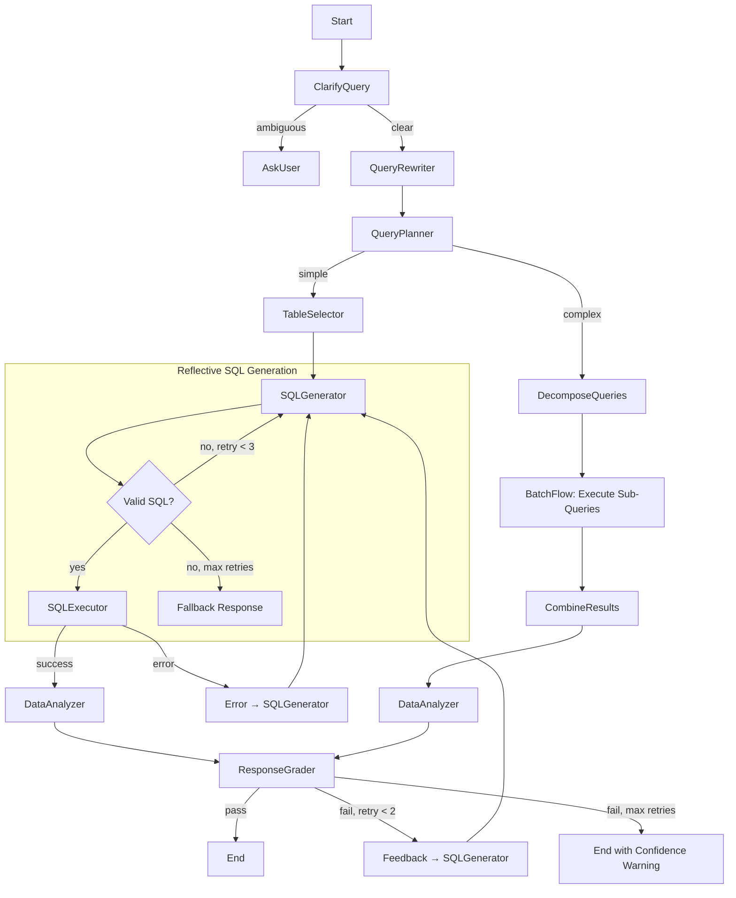
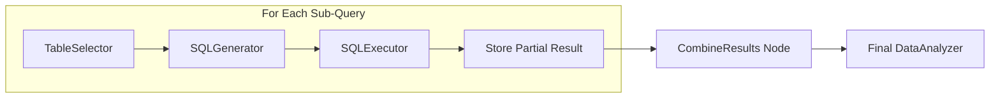

# Design Doc: NBA Data Analyst Agent

> Please DON'T remove notes for AI
> 
> This document serves as the complete specification for building the NBA Data Analyst Agent.
> Follow the Agentic Coding methodology: design thoroughly before implementation.
> The system relies exclusively on a local DuckDB database which serves as the single source of truth.

---

## 1. Requirements

> Notes for AI: Keep it simple and clear. Focus on concrete user stories.

The NBA Data Analyst Agent is a Text-to-SQL system that allows users to ask natural language questions about NBA data stored in a local DuckDB database. The system translates questions into SQL, executes queries, and returns insightful answers with explanations of how the data was derived.

### Core Capabilities

| Capability | Description |
|------------|-------------|
| DuckDB Integration | Connects to `src/backend/data/nba.duckdb` as exclusive data source |
| Schema Introspection | Dynamically explores database structure using semantic search |
| Hybrid Table Selection | Combines embedding similarity with LLM reasoning to find relevant tables |
| Reflective SQL Generation | Self-correcting SQL generation with syntax validation |
| Query Decomposition | Breaks complex multi-part questions into logical sub-queries |
| Conversation Memory | Tracks context for natural follow-up questions |
| Transparent Responses | Every answer includes explanation of methodology |
| Resilient Execution | Circuit breakers, timeouts, and graceful error handling |
| Structured Logging | Full execution traces for debugging and analytics |

### User Stories

**Basic Queries:**
- As a user, I want to ask "Who had the highest FG% in 2023?" and get a direct answer with an explanation of how it was calculated.

**Complex Queries:**
- As a user, I want to ask multi-part questions like "Compare the Lakers and Celtics offensive stats, then tell me which team had better efficiency" and have the system break this into logical steps.

**Conversational Flow:**
- As a user, after asking about the Lakers, I want to follow up with "How about the Warriors?" and have the system understand I'm comparing the same stats.

**Disambiguation:**
- As a user, if I ask "Who is the best player?", I want the system to ask me to clarify my criteria rather than guessing.

**Transparency:**
- As a user, I want to understand *how* the answer was derived, including which tables were used and what the SQL query looked like (on request).

---

## 2. Architecture Overview

> Notes for AI: This section describes the high-level design decisions.

### Design Principles

1. **Reflective Generation**: SQL generation includes built-in self-correction with syntax validation and retry loops, eliminating the need for separate error-fixing nodes.

2. **Hybrid Search**: Table selection uses embedding similarity as a pre-filter before LLM selection, handling large schemas (50+ tables) efficiently.

3. **Query Planning**: A dedicated planning layer decides if complex queries should be decomposed into sub-queries executed via BatchFlow.

4. **Conversation Awareness**: Query rewriting resolves pronouns and references using conversation history.

5. **Resilience by Default**: All external calls (DB, LLM) include circuit breakers, timeouts, and rate limiting at the utility level.

6. **Observability First**: Structured logging captures full execution traces for every request.

### Component Diagram

```
┌─────────────────────────────────────────────────────────────────────────────┐
│                           NBA Data Analyst Agent                            │
├─────────────────────────────────────────────────────────────────────────────┤
│                                                                             │
│  ┌──────────────┐     ┌──────────────────────────────────────────────────┐ │
│  │   Utilities  │     │                    Nodes                         │ │
│  ├──────────────┤     ├──────────────────────────────────────────────────┤ │
│  │ • call_llm   │     │  ClarifyQuery → QueryRewriter → QueryPlanner     │ │
│  │ • duckdb     │     │        ↓                              ↓          │ │
│  │ • embeddings │     │  TableSelector ←──────────────────────┘          │ │
│  │ • logger     │     │        ↓                                         │ │
│  │ • memory     │     │  SQLGenerator (Reflective) ←─────┐               │ │
│  │ • cache      │     │        ↓                         │               │ │
│  └──────────────┘     │  SQLExecutor ───[error]──────────┤               │ │
│                       │        ↓ [success]               │               │ │
│                       │  DataAnalyzer                    │               │ │
│                       │        ↓                         │               │ │
│                       │  ResponseGrader ───[fail]────────┘               │ │
│                       │        ↓ [pass]                                  │ │
│                       │      [END]                                       │ │
│                       └──────────────────────────────────────────────────┘ │
│                                                                             │
│  ┌──────────────────────────────────────────────────────────────────────┐  │
│  │                         Shared Store (Blackboard)                     │  │
│  │  • Pydantic-validated schema                                          │  │
│  │  • Conversation memory integration                                    │  │
│  │  • Structured execution trace                                         │  │
│  └──────────────────────────────────────────────────────────────────────┘  │
└─────────────────────────────────────────────────────────────────────────────┘
```

---

## 3. Flow Design

> Notes for AI:
> 1. Primary pattern: Workflow with Reflective Agent nodes
> 2. Secondary pattern: Conditional BatchFlow for multi-step queries
> 3. The flow includes multiple feedback loops for self-correction

### Flow High-Level Design

1. **ClarifyQuery**: Determines if the user's question is answerable or needs clarification.
2. **QueryRewriter**: Normalizes and expands the query using conversation context.
3. **QueryPlanner**: Decides if the query needs decomposition; if so, creates a sub-query plan.
4. **TableSelector**: Uses hybrid search (embeddings + LLM) to select relevant tables and fetch schemas.
5. **SQLGenerator**: Generates SQL with built-in reflection (syntax check + schema validation).
6. **SQLExecutor**: Executes SQL with circuit breaker protection.
7. **DataAnalyzer**: Synthesizes results into natural language with transparency notes.
8. **ResponseGrader**: Final quality check; can trigger regeneration if issues found.

### Main Flow Diagram



### Sub-Flow: Multi-Step Query Execution

For complex queries that are decomposed by `QueryPlanner`:



---

## 4. Utility Functions

> Notes for AI:
> 1. Utilities handle ALL external interactions (DB, LLM, embeddings, logging)
> 2. Each utility is independently testable
> 3. Resilience (retries, circuit breakers) is built into utilities, not nodes

### 4.1 DuckDB Client (`utils/duckdb_client.py`)

**Purpose**: All database interactions with resilience built-in.

| Method | Input | Output | Description |
|--------|-------|--------|-------------|
| `get_all_tables()` | — | `List[TableMeta]` | Returns table names + descriptions |
| `get_table_schema(tables)` | `List[str]` | `str` (DDL) | Returns CREATE TABLE statements |
| `execute_query(sql)` | `str` | `DataFrame` or raises | Read-only execution with timeout |
| `validate_sql_syntax(sql)` | `str` | `ValidationResult` | Checks SQL syntax without executing |

**Resilience Config**:
- Query timeout: 30 seconds
- Circuit breaker: Trip after 3 consecutive failures, 60s recovery

```python
# Example implementation signature
class DuckDBClient:
    def __init__(self, db_path: str, timeout: int = 30):
        ...
    
    @circuit_breaker(threshold=3, recovery=60)
    def execute_query(self, sql: str) -> pd.DataFrame:
        """Execute read-only query with timeout protection."""
        ...
    
    def validate_sql_syntax(self, sql: str) -> ValidationResult:
        """Parse SQL without execution to check syntax."""
        ...
```

### 4.2 LLM Client (`utils/call_llm.py`)

**Purpose**: Unified LLM interface with caching and rate limiting.

| Method | Input | Output | Description |
|--------|-------|--------|-------------|
| `call_llm(prompt, schema?)` | `str`, `Optional[BaseModel]` | `str` or `BaseModel` | Main generation with optional structured output |
| `call_llm_cached(prompt)` | `str` | `str` | Semantic cache lookup first |

**Resilience Config**:
- Rate limit: 60 RPM with exponential backoff
- Semantic cache: 0.95 similarity threshold, 24h TTL
- Circuit breaker: Trip after 5 failures, 120s recovery

```python
# Example implementation signature
@circuit_breaker(threshold=5, recovery=120)
@rate_limit(rpm=60, backoff="exponential")
def call_llm(
    prompt: str,
    response_schema: Optional[Type[BaseModel]] = None,
    use_cache: bool = True
) -> Union[str, BaseModel]:
    """Call LLM with resilience and optional structured output."""
    ...
```

### 4.3 Embedding Service (`utils/embeddings.py`)

**Purpose**: Vector embeddings for semantic search and caching.

| Method | Input | Output | Description |
|--------|-------|--------|-------------|
| `embed_text(text)` | `str` | `List[float]` | Generate embedding vector |
| `embed_batch(texts)` | `List[str]` | `List[List[float]]` | Batch embedding |
| `find_similar(query_vec, candidates, top_k)` | vector, vectors, int | `List[int]` | Return top-k indices by similarity |

```python
# Example: Used by TableSelector for hybrid search
def find_relevant_tables(query: str, table_embeddings: dict, top_k: int = 10) -> List[str]:
    """Pre-filter tables by embedding similarity before LLM selection."""
    query_vec = embed_text(query)
    return find_similar(query_vec, table_embeddings, top_k)
```

### 4.4 Conversation Memory (`utils/memory.py`)

**Purpose**: Track conversation context for follow-up questions.

| Method | Input | Output | Description |
|--------|-------|--------|-------------|
| `add_turn(question, answer, sql)` | str, str, str | — | Store a Q&A turn |
| `get_context(n_turns)` | int | `ConversationContext` | Retrieve last n turns |
| `extract_references(query)` | str | `ResolvedReferences` | Resolve pronouns/references |

```python
# Example: Resolving "How about the Warriors?" after Lakers question
context = memory.get_context(n_turns=3)
resolved = memory.extract_references("How about the Warriors?")
# resolved.expanded_query = "Show the same offensive stats for the Warriors"
```

### 4.5 Structured Logger (`utils/logger.py`)

**Purpose**: Emit structured logs for debugging and analytics.

| Method | Input | Output | Description |
|--------|-------|--------|-------------|
| `log_node_start(node, inputs)` | str, dict | — | Log node entry |
| `log_node_end(node, outputs, status)` | str, dict, str | — | Log node exit |
| `log_llm_call(prompt, response, latency)` | str, str, float | — | Log LLM interaction |
| `get_trace()` | — | `ExecutionTrace` | Get full execution trace |

**Log Schema**:
```json
{
  "timestamp": "2024-01-15T10:30:00Z",
  "trace_id": "uuid",
  "node": "SQLGenerator",
  "event": "node_end",
  "inputs": {"question": "...", "schema": "..."},
  "outputs": {"sql": "SELECT..."},
  "status": "success",
  "latency_ms": 1234,
  "retry_count": 0
}
```

### 4.6 Semantic Cache (`utils/cache.py`)

**Purpose**: Cache LLM responses by semantic similarity to reduce costs and latency.

| Method | Input | Output | Description |
|--------|-------|--------|-------------|
| `get(prompt)` | `str` | `Optional[str]` | Check cache by semantic similarity |
| `set(prompt, response)` | `str`, `str` | — | Store prompt-response pair |
| `invalidate(pattern)` | `str` | `int` | Invalidate matching entries |

**Config**:
- Similarity threshold: 0.95
- TTL: 24 hours
- Max entries: 10,000

---

## 5. Data Design

> Notes for AI: 
> 1. Use Pydantic models for type safety and validation
> 2. Minimize redundancy — use references where possible
> 3. The shared store is the "Blackboard" that all nodes read/write

### 5.1 Pydantic Models

```python
from pydantic import BaseModel, Field
from typing import Optional, List
from enum import Enum
import pandas as pd

class QueryIntent(str, Enum):
    CLEAR = "clear"
    AMBIGUOUS = "ambiguous"

class QueryComplexity(str, Enum):
    SIMPLE = "simple"      # Single SQL query sufficient
    COMPLEX = "complex"    # Needs decomposition

class GradeStatus(str, Enum):
    PASS = "pass"
    FAIL = "fail"

class TableMeta(BaseModel):
    """Metadata for a database table."""
    name: str
    description: str
    row_count: Optional[int] = None

class SubQuery(BaseModel):
    """A decomposed sub-query for complex questions."""
    id: str
    description: str
    depends_on: List[str] = []  # IDs of sub-queries this depends on
    sql: Optional[str] = None
    result: Optional[dict] = None

class QueryPlan(BaseModel):
    """Plan for executing a query (simple or decomposed)."""
    complexity: QueryComplexity
    sub_queries: List[SubQuery] = []
    combination_strategy: str = "synthesize"  # How to combine results

class ValidationResult(BaseModel):
    """Result of SQL syntax validation."""
    is_valid: bool
    errors: List[str] = []
    warnings: List[str] = []

class SQLGenerationAttempt(BaseModel):
    """Track each SQL generation attempt for debugging."""
    attempt_number: int
    sql: str
    validation: ValidationResult
    execution_error: Optional[str] = None

class GraderFeedback(BaseModel):
    """Feedback from the ResponseGrader node."""
    status: GradeStatus
    issues: List[str] = []
    suggestions: List[str] = []
    confidence: float = Field(ge=0.0, le=1.0)

class ConversationTurn(BaseModel):
    """A single turn in the conversation history."""
    question: str
    rewritten_query: Optional[str] = None
    sql: Optional[str] = None
    answer: Optional[str] = None

class ExecutionTrace(BaseModel):
    """Full trace of the execution for debugging."""
    trace_id: str
    nodes_executed: List[str] = []
    llm_calls: int = 0
    total_latency_ms: int = 0
    retries: int = 0
```

### 5.2 Shared Store Schema

```python
shared = {
    # ===== Input =====
    "question": str,                    # Original user question
    
    # ===== Conversation Context =====
    "conversation_history": List[ConversationTurn],  # Previous turns
    "resolved_question": str,           # Question with references resolved
    
    # ===== Query Understanding =====
    "intent": QueryIntent,              # CLEAR or AMBIGUOUS
    "clarification_questions": List[str],  # If ambiguous, what to ask
    "rewritten_query": str,             # Normalized query for processing
    "query_plan": QueryPlan,            # Simple or decomposed plan
    
    # ===== Schema Context =====
    "available_tables": List[TableMeta],  # All tables in DB (cached)
    "table_embeddings": dict,           # {table_name: vector} (cached)
    "candidate_tables": List[str],      # Pre-filtered by embedding similarity
    "selected_tables": List[str],       # Final selection by LLM
    "table_schemas": str,               # DDL for selected tables
    
    # ===== SQL Generation (Reflective) =====
    "generation_attempts": List[SQLGenerationAttempt],  # Track all attempts
    "sql_query": str,                   # Current/final SQL
    "sql_is_valid": bool,               # Validation status
    
    # ===== Execution =====
    "query_result": pd.DataFrame,       # Raw data from DuckDB
    "execution_error": Optional[str],   # Error message if failed
    
    # ===== Response =====
    "final_answer": str,                # Natural language response
    "transparency_note": str,           # Explanation of methodology
    "grader_feedback": GraderFeedback,  # Quality assessment
    
    # ===== Observability =====
    "execution_trace": ExecutionTrace,  # Full debug trace
    
    # ===== Control Flow =====
    "total_retries": int,               # Global retry counter
    "max_retries": int,                 # Configurable limit (default: 3)
}
```

---

## 6. Node Design

> Notes for AI: 
> 1. Each node follows prep → exec → post pattern
> 2. Reflective nodes have internal validation loops
> 3. All nodes emit structured logs via the logger utility

### 6.1 ClarifyQuery

**Purpose**: Determine if the question is specific enough to answer.

- **Type**: Regular
- **Prep**: Read `question` and `conversation_history`
- **Exec**: 
  - LLM analyzes if the query is specific enough for SQL generation
  - If ambiguous, generate 2-3 targeted clarification options
  - Consider conversation context (might clarify ambiguity)
- **Post**: 
  - Set `intent` to CLEAR or AMBIGUOUS
  - If AMBIGUOUS: populate `clarification_questions`, return `"ambiguous"`
  - If CLEAR: return `"clear"`

**Prompt Strategy**: Few-shot with examples of ambiguous vs. clear queries

```yaml
# Example prompt structure
You are analyzing if a user's NBA question is specific enough to query a database.

CLEAR queries have:
- Specific metrics (points, FG%, rebounds)
- Time bounds (season, year, date range)  
- Entity references (player name, team)

AMBIGUOUS queries need clarification:
- "Who is the best?" → Best by what metric?
- "How did they do?" → Who is "they"? What timeframe?

Conversation context (may resolve ambiguity):
{conversation_history}

Current question: {question}

Output as YAML:
```yaml
intent: clear | ambiguous
reasoning: <one sentence>
clarification_questions:  # Only if ambiguous
  - <question 1>
  - <question 2>
```
```

---

### 6.2 QueryRewriter

**Purpose**: Normalize the query and resolve conversational references.

- **Type**: Regular
- **Prep**: Read `question`, `conversation_history`
- **Exec**:
  - Resolve pronouns and references ("they", "that team", "same stats")
  - Expand abbreviations and normalize terminology
  - Produce a self-contained query suitable for SQL generation
- **Post**: Store `rewritten_query` and `resolved_question`

**Example Transformations**:
```
Previous: "Show Lakers offensive stats for 2023"
Current: "How about the Warriors?"
Rewritten: "Show Warriors offensive stats for 2023"

Previous: "Who led the league in assists?"
Current: "What about rebounds?"
Rewritten: "Who led the league in rebounds?"
```

---

### 6.3 QueryPlanner

**Purpose**: Decide if the query needs decomposition into sub-queries.

- **Type**: Regular
- **Prep**: Read `rewritten_query`
- **Exec**:
  - Analyze query complexity
  - If SIMPLE: single SQL can answer → proceed normally
  - If COMPLEX: decompose into ordered sub-queries with dependencies
- **Post**: 
  - Store `query_plan`
  - Return `"simple"` or `"complex"`

**Complexity Indicators**:
- Multiple distinct aggregations across different dimensions
- Explicit comparisons ("compare X and Y")
- Sequential analysis ("first find X, then calculate Y")
- Conditional logic ("if X then show Y")

**Example Decomposition**:
```yaml
# Query: "Compare Lakers and Celtics PPG, then tell me which had better efficiency"
complexity: complex
sub_queries:
  - id: "lakers_stats"
    description: "Get Lakers points per game and efficiency metrics"
    depends_on: []
  - id: "celtics_stats"  
    description: "Get Celtics points per game and efficiency metrics"
    depends_on: []
  - id: "comparison"
    description: "Compare efficiency metrics between teams"
    depends_on: ["lakers_stats", "celtics_stats"]
combination_strategy: "synthesize_comparison"
```

---

### 6.4 TableSelector

**Purpose**: Identify relevant tables using hybrid search (embeddings + LLM).

- **Type**: Regular
- **Prep**: Read `rewritten_query`, `available_tables`, `table_embeddings`
- **Exec**:
  1. **Embedding Pre-Filter**: Find top-10 tables by semantic similarity
  2. **LLM Selection**: From candidates, select 3-5 most relevant tables
  3. **Schema Fetch**: Get DDL for selected tables
- **Post**: Store `candidate_tables`, `selected_tables`, `table_schemas`

**Why Hybrid Search?**
- Embeddings handle large table counts efficiently (50+ tables)
- LLM provides reasoning about relationships and query intent
- Reduces context window usage by filtering irrelevant tables

**Prompt Strategy**:
```yaml
Given a user question about NBA data, select the most relevant tables.

Question: {rewritten_query}

Candidate tables (pre-filtered by relevance):
{candidate_tables_with_descriptions}

Select 3-5 tables that would be needed to answer this question.
Consider:
- Which tables contain the metrics mentioned?
- Which tables would need to be JOINed?
- Are there lookup/dimension tables needed?

Output as YAML:
```yaml
selected_tables:
  - table_name: <name>
    reason: <why needed>
  - ...
```
```

---

### 6.5 SQLGenerator (Reflective)

**Purpose**: Generate valid DuckDB SQL with built-in self-correction.

- **Type**: Regular (with internal reflection loop)
- **Max Retries**: 3 (configurable)
- **Prep**: Read `rewritten_query`, `table_schemas`, `grader_feedback` (if retry), `execution_error` (if retry)
- **Exec**:
  1. Generate SQL candidate
  2. **Internal Validation**:
     - Syntax check via `duckdb_client.validate_sql_syntax()`
     - Schema check: verify all referenced columns exist in `table_schemas`
  3. If invalid and retries remaining: incorporate errors and regenerate
  4. If invalid and max retries: return fallback flag
- **Post**: 
  - Store `sql_query`, `sql_is_valid`, append to `generation_attempts`
  - Return `"valid"`, `"retry"`, or `"fallback"`

**Prompt Strategy** (includes self-correction context):
```yaml
You are a DuckDB SQL expert. Generate a query to answer the user's question.

Question: {rewritten_query}

Available Schema:
{table_schemas}

{if previous_attempt}
Your previous attempt had issues:
- SQL: {previous_sql}
- Errors: {validation_errors}
- Feedback: {grader_feedback}

Fix these issues in your new attempt.
{endif}

Rules:
- Use only columns that exist in the schema above
- Use DuckDB SQL syntax (not PostgreSQL or MySQL)
- Include appropriate JOINs based on foreign key relationships
- Use aliases for clarity

Output as YAML:
```yaml
thinking: <your reasoning about table relationships and approach>
sql: |
  <your SQL query>
```
```

---

### 6.6 SQLExecutor

**Purpose**: Execute SQL safely with resilience.

- **Type**: Regular
- **Prep**: Read `sql_query`
- **Exec**: 
  - Call `duckdb_client.execute_query(sql_query)`
  - Circuit breaker handles repeated failures
  - Timeout prevents runaway queries
- **Post**: 
  - If success: store `query_result`, return `"success"`
  - If error: store `execution_error`, increment retry counter, return `"error"`

**Error Handling**:
- Timeout → "Query took too long. Try a simpler question."
- Syntax error → Feed back to SQLGenerator for correction
- No results → May be valid (flag for grader to evaluate)

---

### 6.7 DataAnalyzer

**Purpose**: Synthesize SQL results into natural language with explanation.

- **Type**: Regular
- **Prep**: Read `question`, `rewritten_query`, `sql_query`, `query_result`
- **Exec**:
  - Analyze the data returned
  - Generate natural language answer
  - Create transparency note explaining methodology
- **Post**: Store `final_answer`, `transparency_note`

**Prompt Strategy**:
```yaml
You are an NBA data analyst explaining query results to a fan.

Original Question: {question}
Interpreted As: {rewritten_query}

SQL Query Used:
{sql_query}

Results:
{query_result_formatted}

Provide:
1. A direct answer to the question in conversational language
2. A brief "How I found this" explanation (1-2 sentences)

Output as YAML:
```yaml
answer: |
  <natural language answer>
transparency_note: |
  <brief explanation of methodology>
```
```

---

### 6.8 ResponseGrader

**Purpose**: Quality check ensuring the response actually answers the question.

- **Type**: Regular
- **Prep**: Read `question`, `rewritten_query`, `sql_query`, `query_result`, `final_answer`
- **Exec**: LLM acts as critic, checking:
  1. Does the SQL actually answer the specific question asked?
  2. Is the data interpretation mathematically/logically correct?
  3. Does the final answer make sense given the data?
  4. Are there any hallucinations or unsupported claims?
- **Post**:
  - Store `grader_feedback`
  - If PASS: return `"pass"`
  - If FAIL and retries remaining: return `"fail"` (loops to SQLGenerator)
  - If FAIL and max retries: return `"pass_with_warning"` (end with confidence caveat)

**Prompt Strategy**:
```yaml
You are a quality assurance reviewer for an NBA data analysis system.

Original Question: {question}
Interpreted As: {rewritten_query}

SQL Query:
{sql_query}

Query Results:
{query_result}

Generated Answer:
{final_answer}

Evaluate:
1. CORRECTNESS: Does the SQL correctly answer the question?
2. INTERPRETATION: Is the answer mathematically accurate given the data?
3. COMPLETENESS: Does the answer fully address what was asked?
4. HALLUCINATION: Does the answer make claims not supported by the data?

Output as YAML:
```yaml
status: pass | fail
confidence: <0.0 to 1.0>
issues:  # Only if fail
  - <issue 1>
  - <issue 2>
suggestions:  # Specific fixes for SQLGenerator
  - <suggestion 1>
```
```

---

### 6.9 CombineResults (for Complex Queries)

**Purpose**: Merge results from multiple sub-queries into unified context.

- **Type**: Regular
- **Prep**: Read `query_plan`, collect all sub-query results from shared store
- **Exec**: 
  - Based on `combination_strategy`, merge results
  - For comparisons: structure data side-by-side
  - For sequential: chain results logically
- **Post**: Store combined results for DataAnalyzer

---

## 7. Resilience Patterns

> Notes for AI: These patterns are implemented in utilities and applied via decorators.

### 7.1 Circuit Breaker

Prevents cascade failures when external services are down.

```python
# States: CLOSED (normal) → OPEN (failing) → HALF_OPEN (testing recovery)
@circuit_breaker(
    threshold=5,        # Failures before opening
    recovery=60,        # Seconds before half-open
    half_open_max=1     # Test requests in half-open state
)
def call_llm(prompt: str) -> str:
    ...
```

### 7.2 Rate Limiting with Backoff

Handles API rate limits gracefully.

```python
@rate_limit(
    rpm=60,                    # Requests per minute
    backoff="exponential",     # 2s, 4s, 8s, ...
    max_backoff=60             # Cap at 60 seconds
)
def call_llm(prompt: str) -> str:
    ...
```

### 7.3 Timeout Protection

Prevents runaway queries.

```python
@timeout(seconds=30)
def execute_query(sql: str) -> pd.DataFrame:
    ...
```

### 7.4 Semantic Caching

Reduces redundant LLM calls.

```python
def call_llm_cached(prompt: str) -> str:
    cached = semantic_cache.get(prompt, similarity_threshold=0.95)
    if cached:
        return cached
    response = call_llm(prompt)
    semantic_cache.set(prompt, response)
    return response
```

---

## 8. Logging and Observability

> Notes for AI: All nodes should emit structured logs for debugging.

### 8.1 Log Events

| Event | When | Key Fields |
|-------|------|------------|
| `node_start` | Node begins | node_name, inputs |
| `node_end` | Node completes | node_name, outputs, status, latency_ms |
| `llm_call` | LLM invoked | prompt_hash, response_length, latency_ms, cached |
| `sql_execution` | Query runs | sql_hash, row_count, latency_ms |
| `retry` | Retry triggered | node_name, attempt, error |
| `circuit_open` | Breaker trips | service, failure_count |

### 8.2 Execution Trace

Every request generates a complete trace:

```json
{
  "trace_id": "abc-123",
  "question": "Who led the league in points?",
  "nodes_executed": [
    {"node": "ClarifyQuery", "status": "success", "latency_ms": 234},
    {"node": "QueryRewriter", "status": "success", "latency_ms": 189},
    {"node": "QueryPlanner", "status": "success", "latency_ms": 156},
    {"node": "TableSelector", "status": "success", "latency_ms": 445},
    {"node": "SQLGenerator", "status": "success", "latency_ms": 567, "attempts": 1},
    {"node": "SQLExecutor", "status": "success", "latency_ms": 45},
    {"node": "DataAnalyzer", "status": "success", "latency_ms": 432},
    {"node": "ResponseGrader", "status": "pass", "latency_ms": 398}
  ],
  "total_latency_ms": 2466,
  "llm_calls": 5,
  "retries": 0,
  "cache_hits": 1
}
```

### 8.3 Debug Mode

When enabled, traces include full prompt/response pairs (truncated for large content):

```python
# Enable via environment variable or shared store flag
shared["debug_mode"] = True
```

---

## 9. Evaluation and Testing

> Notes for AI: Define acceptance criteria for the system.

### 9.1 Test Categories

| Category | Description | Example |
|----------|-------------|---------|
| **Unit** | Individual utility functions | `test_validate_sql_syntax()` |
| **Node** | Single node behavior | `test_table_selector_picks_relevant_tables()` |
| **Flow** | End-to-end happy path | `test_simple_query_returns_answer()` |
| **Edge Cases** | Error handling | `test_ambiguous_query_asks_clarification()` |
| **Regression** | Known failure modes | `test_no_hallucinated_columns()` |

### 9.2 Golden Dataset

Maintain a set of question-answer pairs for regression testing:

```yaml
# tests/golden_dataset.yaml
- question: "Who led the league in points in 2023?"
  expected_sql_contains: ["SELECT", "points", "2023", "ORDER BY", "LIMIT"]
  expected_answer_contains: ["points", "led"]
  
- question: "Compare Lakers and Celtics win percentage"
  complexity: complex
  expected_sub_queries: 2
```

### 9.3 LLM-as-Judge Evaluation

For subjective quality assessment:

```yaml
# Evaluation dimensions
- correctness: Does the answer match ground truth?
- completeness: Is the question fully addressed?
- clarity: Is the answer easy to understand?
- transparency: Is the methodology explained?
```

### 9.4 Performance Targets

| Metric | Target |
|--------|--------|
| Simple query latency | < 3 seconds |
| Complex query latency | < 10 seconds |
| SQL generation success rate | > 95% |
| Grader pass rate (first attempt) | > 85% |
| End-to-end success rate | > 90% |

---

## 10. Repository Structure

```
nba-analyst-agent/
├── main.py                    # Entry point
├── flow.py                    # Flow definitions
├── nodes.py                   # Node implementations
├── models.py                  # Pydantic models
├── utils/
│   ├── __init__.py
│   ├── call_llm.py           # LLM client with resilience
│   ├── duckdb_client.py      # Database operations
│   ├── embeddings.py         # Embedding service
│   ├── memory.py             # Conversation memory
│   ├── cache.py              # Semantic cache
│   ├── logger.py             # Structured logging
│   └── resilience.py         # Circuit breaker, rate limit decorators
├── tests/
│   ├── test_utils/
│   ├── test_nodes/
│   ├── test_flows/
│   └── golden_dataset.yaml
├── data/
│   └── nba.duckdb            # Database file
├── docs/
│   └── design.md             # This document
└── requirements.txt
```

---

## 11. Configuration

```yaml
# config.yaml
database:
  path: "data/nba.duckdb"
  timeout_seconds: 30

llm:
  model: "gpt-4o"
  temperature: 0.1
  max_tokens: 2000
  rate_limit_rpm: 60

resilience:
  circuit_breaker_threshold: 5
  circuit_breaker_recovery_seconds: 60
  max_retries: 3
  backoff_base_seconds: 2

cache:
  semantic_threshold: 0.95
  ttl_hours: 24
  max_entries: 10000

logging:
  level: "INFO"
  structured: true
  include_prompts: false  # Set true for debug mode
```

---

## 12. Future Considerations

> Notes for AI: These are out of scope for initial implementation but should inform design decisions.

1. **Visualization Generation**: Add nodes to create charts/graphs from results
2. **Feedback Learning**: Use grader feedback to improve prompts over time
3. **Streaming Responses**: Support token-by-token streaming for long answers
4. **Multi-User Memory**: Separate conversation contexts per user session