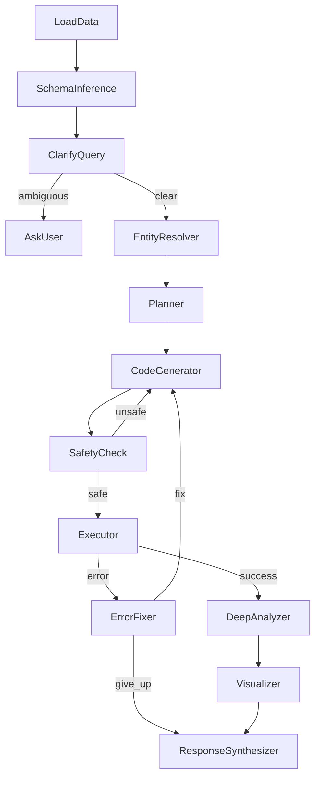

# Design Doc: Relational Data Analyst Agent

> Please DON'T remove notes for AI

## Requirements

> Notes for AI: Keep it simple and clear.
> If the requirements are abstract, write concrete user stories

The Relational Data Analyst Agent is an LLM-powered system that allows users to ask natural language questions about CSV data. The agent:

1. **Loads CSV files** from a designated folder (`CSV/`)
2. **Infers schemas** from the loaded dataframes
3. **Resolves entities** mentioned in queries across all tables
4. **Plans and generates code** to answer user questions
5. **Executes code safely** in a sandboxed environment
6. **Performs deep analysis** with statistical comparisons
7. **Synthesizes narrative responses** from analysis results
8. **Learns from queries** via persistent KnowledgeStore
9. **Handles errors gracefully** with automatic retry and error correction

### User Stories

- As a user, I want to ask questions about my data in plain English
- As a user, I want to compare entities (e.g., "Compare LeBron James and Tracy McGrady careers")
- As a user, I want the system to automatically understand my CSV file structures
- As a user, I want deep statistical analysis, not just simple lookups
- As a user, I want narrative responses that tell a story about the data
- As a user, I want safe code execution that prevents malicious operations
- As a user, I want the system to learn and improve from previous queries

## Flow Design

> Notes for AI:
> 1. Consider the design patterns of agent, map-reduce, rag, and workflow. Apply them if they fit.
> 2. Present a concise, high-level description of the workflow.

### Applicable Design Pattern:

1. **Workflow Pattern**: A sequential pipeline of nodes with conditional branching for error handling
2. **Agent Pattern**: LLM-driven planning and code generation based on context (schema + question)
3. **Error Correction Loop**: Automatic retry mechanism with max attempts
4. **Memory Pattern**: KnowledgeStore for persistent learning across queries

### Flow High-Level Design:

1. **LoadData**: Scans CSV folder and loads all CSV files as pandas DataFrames
2. **SchemaInference**: Extracts column names from each DataFrame to build schema
3. **ClarifyQuery**: Validates the user's question against available schema
4. **EntityResolver**: Discovers which tables contain data about entities mentioned in query
5. **Planner**: Uses LLM to create analysis plan, informed by entity resolution and KnowledgeStore hints
6. **CodeGenerator**: Uses LLM to generate Python/pandas code
7. **SafetyCheck**: AST-based security check to block dangerous imports
8. **Executor**: Runs generated code in sandboxed environment
9. **ErrorFixer**: Handles execution errors with retry logic (max 3 attempts)
10. **DeepAnalyzer**: Performs comprehensive statistical analysis on execution results
11. **Visualizer**: Creates visualizations for DataFrame results
12. **ResponseSynthesizer**: Uses LLM to generate narrative response from analysis
13. **KnowledgeUpdater**: Stores successful patterns and learnings for future queries



## Utility Functions

> Notes for AI:
> 1. Understand the utility function definition thoroughly by reviewing the doc.
> 2. Include only the necessary utility functions, based on nodes in the flow.

1. **Call LLM** (`utils/call_llm.py`)
   - *Input*: prompt (str)
   - *Output*: response (str)
   - *Config*: Uses OpenRouter API with configurable model via environment variables
   - *Environment Variables*:
     - `OPENROUTER_API_KEY`: API key for OpenRouter
     - `LLM_MODEL`: Model to use (default: meta-llama/llama-3.3-70b-instruct)
   - Used by: Planner, CodeGenerator, EntityResolver, DeepAnalyzer, ResponseSynthesizer nodes

2. **KnowledgeStore** (`utils/knowledge_store.py`)
   - *Purpose*: Persistent memory for learned patterns and entity mappings
   - *Storage*: JSON file (`knowledge_store.json`)
   - *Methods*:
     - `load()`: Load knowledge from disk
     - `save()`: Persist knowledge to disk
     - `get_entity_hints(entity_name)`: Get known table/column mappings for an entity
     - `add_entity_mapping(entity, table, columns)`: Store new entity discovery
     - `get_successful_patterns(query_type)`: Get past successful query patterns
     - `add_successful_pattern(query_type, pattern)`: Store successful pattern
   - *Important*: Knowledge is used as hints/guides, never as absolute facts

## Node Design

### Shared Store

> Notes for AI: Try to minimize data redundancy

The shared store structure is organized as follows:

```python
shared = {
    # Input
    "question": str,              # User's natural language question
    
    # Data loaded from CSV files
    "dfs": dict,                  # {"table_name": pd.DataFrame, ...}
    "schema_str": str,            # Human-readable schema description
    
    # Entity Resolution
    "entities": list,             # Entities extracted from question
    "entity_map": dict,           # {entity: {table: [columns], ...}, ...}
    "knowledge_hints": dict,      # Hints from KnowledgeStore
    
    # Planning and code
    "plan_steps": str,            # LLM-generated analysis plan
    "code_snippet": str,          # Generated Python code
    
    # Execution state
    "exec_result": Any,           # Result from successful code execution
    "exec_error": str,            # Error message if execution failed
    "retry_count": int,           # Number of retry attempts (max 3)
    
    # Deep Analysis
    "deep_analysis": dict,        # Comprehensive analysis results
    
    # Output
    "chart_path": str,            # Path to generated visualization (if any)
    "final_text": str,            # Final formatted response to user
}
```

### Node Steps

> Notes for AI: Carefully decide whether to use Batch/Async Node/Flow.

1. **LoadData**
   - *Purpose*: Load all CSV files from the CSV directory
   - *Type*: Regular Node
   - *Steps*:
     - *prep*: Return path to CSV directory
     - *exec*: Scan directory and read each .csv file into a DataFrame
     - *post*: Store dict of DataFrames in `shared["dfs"]`

2. **SchemaInference**
   - *Purpose*: Extract column information from all DataFrames
   - *Type*: Regular Node
   - *Steps*:
     - *prep*: Read `dfs` from shared store
     - *exec*: Build schema string with table names and column lists
     - *post*: Store schema in `shared["schema_str"]`

3. **ClarifyQuery**
   - *Purpose*: Validate if user question can be answered with available data
   - *Type*: Regular Node
   - *Steps*:
     - *prep*: Read question and schema from shared
     - *exec*: Check for ambiguous references
     - *post*: Return "clear" or "ambiguous" action

4. **AskUser**
   - *Purpose*: Terminal node for ambiguous queries
   - *Type*: Regular Node (terminal)

5. **EntityResolver** (NEW)
   - *Purpose*: Discover all tables/columns containing data about entities in the query
   - *Type*: Regular Node
   - *Steps*:
     - *prep*: Read question, schema, dfs, and load KnowledgeStore hints
     - *exec*: Use LLM to extract entities from question, then search all tables for matches
     - *post*: Store entity_map and knowledge_hints in shared store
   - *Output*: Map of entity → {table → [matching_columns]}

6. **Planner**
   - *Purpose*: Generate analysis plan using LLM, informed by entity resolution
   - *Type*: Regular Node
   - *Steps*:
     - *prep*: Read question, schema, entity_map, and knowledge_hints
     - *exec*: Call LLM with enhanced planning prompt including entity locations
     - *post*: Store plan in `shared["plan_steps"]`

7. **CodeGenerator**
   - *Purpose*: Generate Python/pandas code using LLM
   - *Type*: Regular Node
   - *Steps*:
     - *prep*: Read plan, schema, question, entity_map, and any previous errors
     - *exec*: Call LLM to generate code with awareness of entity locations
     - *post*: Store code in `shared["code_snippet"]`

8. **SafetyCheck**
   - *Purpose*: AST-based security validation
   - *Type*: Regular Node
   - *Steps*:
     - *prep*: Read code snippet
     - *exec*: Parse AST and check for forbidden imports (os, subprocess, sys, shutil)
     - *post*: Return "safe" or "unsafe" action

9. **Executor**
   - *Purpose*: Execute generated code in sandboxed environment
   - *Type*: Regular Node
   - *Steps*:
     - *prep*: Read code and dataframes
     - *exec*: Execute code with only `dfs` and `pd` in scope, extract `final_result`
     - *post*: Store result or error, return "success" or "error" action

10. **ErrorFixer**
    - *Purpose*: Handle execution errors with retry limit
    - *Type*: Regular Node
    - *Config*: MAX_RETRIES = 3
    - *Steps*:
      - *prep*: Read error, code, and retry count
      - *exec*: Check if max retries exceeded
      - *post*: Increment retry count, return "fix" or "give_up" action

11. **DeepAnalyzer** (NEW)
    - *Purpose*: Perform comprehensive statistical analysis on execution results
    - *Type*: Regular Node
    - *Steps*:
      - *prep*: Read exec_result, question, entity_map
      - *exec*: Use LLM to perform deeper analysis (comparisons, trends, rankings, insights)
      - *post*: Store deep_analysis in shared store
    - *Analysis Types*:
      - Career comparisons (for player queries)
      - Statistical rankings and percentiles
      - Trend analysis over time
      - Peak performance identification
      - Head-to-head comparisons

12. **Visualizer**
    - *Purpose*: Create charts for DataFrame results
    - *Type*: Regular Node
    - *Steps*:
      - *prep*: Read execution result
      - *exec*: Generate plot if result is a DataFrame
      - *post*: Store chart path in `shared["chart_path"]`

13. **ResponseSynthesizer** (NEW - replaces ResponseFormatter)
    - *Purpose*: Generate narrative response using LLM
    - *Type*: Regular Node
    - *Steps*:
      - *prep*: Read exec_result, deep_analysis, question, entity_map
      - *exec*: Use LLM to synthesize a coherent narrative response
      - *post*: Store in `shared["final_text"]`, update KnowledgeStore with learnings
    - *Output*: Rich narrative with sections, insights, and comparisons

## File Structure

```
project/
├── main.py                    # Entry point - runs the flow
├── nodes.py                   # All node class definitions
├── flow.py                    # Flow creation and node wiring
├── utils/
│   ├── __init__.py
│   ├── call_llm.py            # OpenRouter LLM wrapper
│   └── knowledge_store.py     # Persistent memory system
├── knowledge_store.json       # Persisted learnings (auto-created)
├── CSV/                       # User's CSV data files go here
├── docs/
│   └── design.md              # This design document
├── .env.example               # Environment variable template
└── requirements.txt           # Python dependencies
```

## Configuration

### Environment Variables

| Variable | Description | Default |
|----------|-------------|---------|
| `OPENROUTER_API_KEY` | OpenRouter API key | (required) |
| `LLM_MODEL` | Model to use | `meta-llama/llama-3.3-70b-instruct` |

### Dependencies

- `pocketflow` - Core flow framework
- `openai` - OpenAI-compatible client for OpenRouter
- `pandas` - Data manipulation

## Usage

1. Place CSV files in the `CSV/` directory
2. Edit the question in `main.py`
3. Run: `python main.py`

### Example Queries

- "Compare the careers of LeBron James and Tracy McGrady"
- "Who had the highest scoring season in NBA history?"
- "What is the average points scored by players on the Chicago team?"
- "Show me the draft history of players from Duke University"
